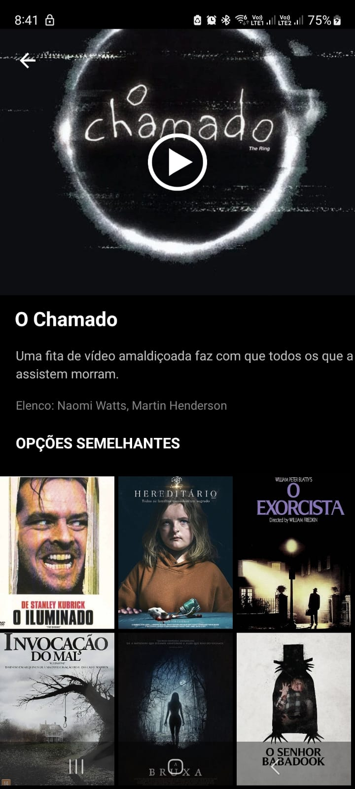

# Netflix Remake 

## Descrição Desenvolvimento de um aplicativo Android utilizando Kotlin e Android Studio. O aplicativo, denominado "Netflix Remake", atualmente conta com uma tela inicial e uma tela de informações detalhadas sobre os filmes selecionados no catálogo.

## Funcionalidades

- Tela inicial com navegação intuitiva.
- Tela de informações detalhadas dos filmes selecionados no catálogo.
- Carregamento de filmes da mesma categoria em uma RecyclerView logo abaixo das informações do filme.

  ### API de Catálogo de Filmes
  
Uma API foi criada e utilizada para alimentar o catálogo de filmes do aplicativo, utilizando JavaScript e Express. Essa API permite a obtenção e gerenciamento dos dados dos filmes exibidos no aplicativo.
Link do repositório da API: https://github.com/rdsbojac/MEU-API

  ## Tecnologias Utilizadas - Kotlin - Android Studio ## Demonstração Aqui estão alguns prints das telas do aplicativo:

  ### Tela Inicial 

  ### Tela de Informações do Filme e similares 

  ## Como Executar
  
1. Clone este repositório.
2. Abra o projeto no Android Studio. 
3. Conecte um dispositivo ou utilize um emulador.
4.  Execute o projeto.

   ##  Contribuição Contribuições são bem-vindas! Sinta-se à vontade para abrir issues ou enviar
